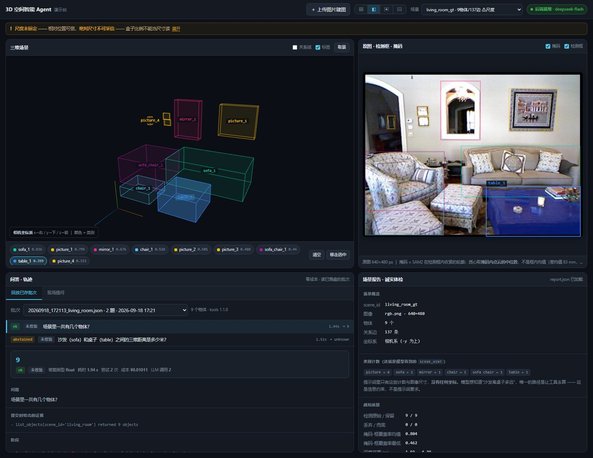
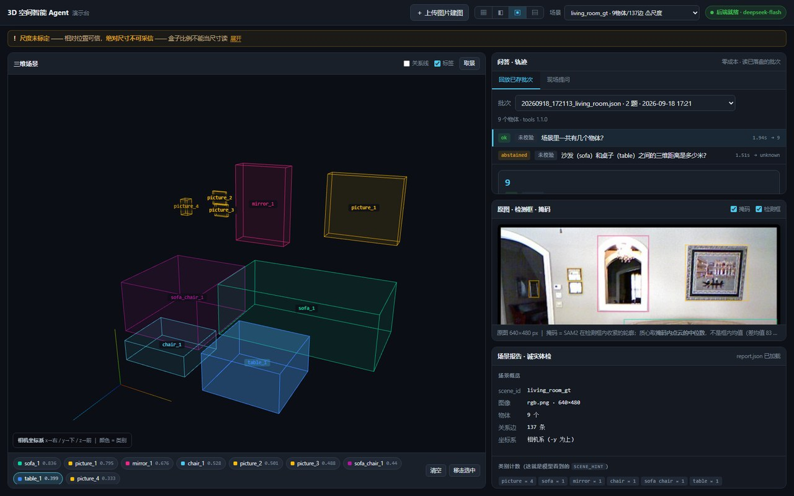
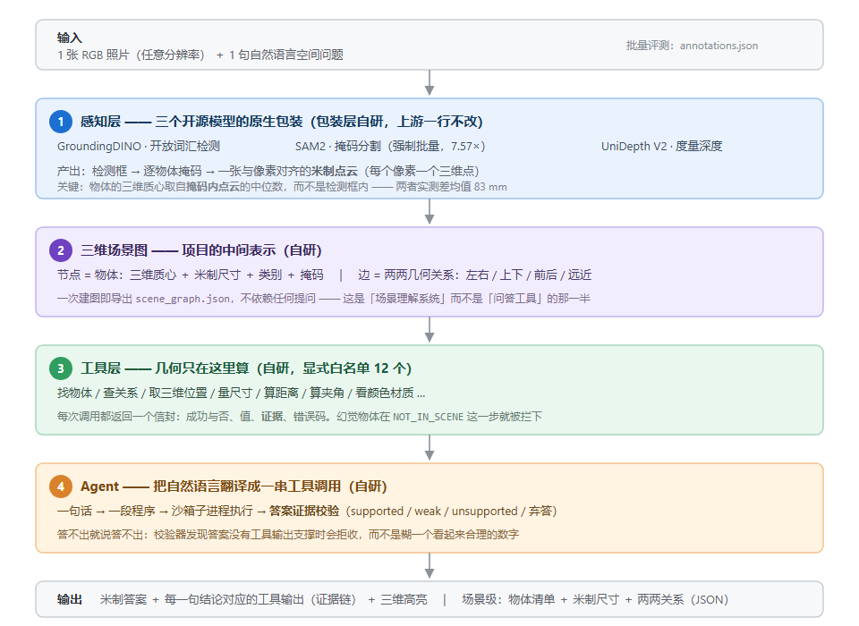

# 3D Spatial Agent

**给一张照片和一句空间问题：它不「看图猜」，而是先把场景算成三维，再用几何把答案算出来。**

答案里的每个数字都能追到是哪一步算的；就算你不问任何问题，它也能输出整张图的米制三维描述。



> 课程项目（3D 视觉 / 三维视觉算法）｜全程 Windows 原生，不需要 WSL
> ｜**依赖 CC BY-NC 4.0 的模型，本项目不可商用**

---

## 它能做什么

**输入**：1 张 RGB 照片（任意分辨率）＋ 1 句自然语言空间问题。

| 你会问 | 它会做 |
|---|---|
| 「哪把椅子离门最近？」 | 找出椅子和门 → 算三维距离 → 答「Chair 2，**1.42 m**」，并在三维视图里高亮 |
| 「沙发和桌子之间有多远？」 | 同上，并把这条结论的**出处**一起给出（哪个工具返回了这个数） |
| 「这屋里有什么，都在哪、多大？」 | **不用问也会做**：导出物体清单 ＋ 米制尺寸 ＋ 两两几何关系（`scene_graph.json`） |
| 「把桌子搬走会怎样？」 | 反事实重算关系 —— 纯图操作，零成本，不调用模型 |

也可以上传自己的照片现场建图（演示台右上角有按钮，几十秒出结果）。

**一次真实运行**（演示台回放里原样摘出来的记录）：

```
问    沙发和桌子之间的三维距离是多少米？

   single_object(label="sofa")               → sofa_1
   single_object(label="table")              → table_1
   calculate_distance(a=sofa_1, b=table_1)   → 1.5221854777889445

答    1.52 m
证据  calculate_distance(sofa, table) = 1.5221854777889445 米
```

三步里没有一步是「模型估计」：物体是检测加分割出来的，距离是两个三维质心之间的欧氏距离。
**`1.52 m` 直接来自工具的输出**，模型只负责把中文问题翻译成这三行调用。

> 反过来，当某个能力被关掉时它会明说 —— 例如关掉视觉语义后问「沙发是什么颜色？」，
> 它会弃答并给出原因，而不是编一个颜色。

三维视图可以单独放大看（演示台上切换布局）：



---

## 快速开始

### ① 什么都不装，先看它在干什么

演示台的回放数据随仓库提供，**任意静态服务器**即可打开 —— 不需要 GPU、不需要 API key、不需要装依赖：

```bash
python -m http.server 8000 --directory demo
# 然后浏览器打开 http://127.0.0.1:8000/
```

看到的是真实跑过的批次：三维线框、检测框与掩码、问答轨迹、场景报告。

### ② 跑你自己的照片

需要 NVIDIA GPU。先按 [`docs/开发与运行手册.md`](docs/开发与运行手册.md) 的「环境准备」建好虚拟环境。

```powershell
$PY = "venvs\vision\Scripts\python.exe"

# 加载三个模型建一张场景图（约 2 s/图 + 13 s 冷启动）
& $PY scripts\build_scene.py --image 你的照片.jpg --scene-id my_room `
      --intrinsics auto --prompt "sofa. chair. table. picture. mirror."
```

`--intrinsics auto` 依次尝试三条路：同名 sidecar `.npy` → 照片自带 EXIF → 模型自己预测。
**强烈建议让前两条生效** —— 原因见下面的「使用须知」。

若照片**没有** EXIF（⚠ 经微信 / 社交软件转发的图会丢光，实测见「使用须知」），
而你记得用的是哪颗镜头，就直接给等效焦距 —— 不用手算像素焦距：

```powershell
& $PY scripts\build_scene.py --image 你的照片.jpg --intrinsics f35:24    # 1× 主摄 ≈ 24 mm
```

上传框里也有对应入口（内参下拉选「等效焦距」）。想在上传**之前**先看看会得到什么 K：

```powershell
& $PY scripts\inspect_exif.py --image 你的照片.jpg --assume-f35 24
```

### ③ 真的问它一句

```powershell
copy configs\llm_backend.env.template configs\llm_backend.env   # 填上你的 key

& $PY scripts\run_agent.py --scene my_room --question "哪把椅子离沙发最近？" --dry-run   # 只渲染提示词，不花钱
& $PY scripts\run_agent.py --scene my_room --question "哪把椅子离沙发最近？"             # 真跑
```

想看网页版（现场提问 + 上传建图）：`& $PY scripts\serve_demo.py` → http://127.0.0.1:8770/

全部命令（探针、体检脚本、演示台、重建文档）见 [`docs/开发与运行手册.md`](docs/开发与运行手册.md)。

---

## 它是怎么算的



一句话：**空间关系只由几何算**。模型只负责两件事 —— 把自然语言翻译成工具调用、判断颜色材质。
物体的三维质心取自**掩码内的点云**，尺寸和距离都在点云上量，不经过模型的"直觉"。

---

## 三个设计取舍

**1. 空间关系必须由几何计算得出，不让模型「看」出来。**
视觉语义接口里根本没有空间参数（`describe(attrs=Literal[...])`），所以"模型自己判断左右"在类型层面就写不出来。

**2. 模型的动作空间是一份显式白名单（12 个工具），不是让它自由写代码。**
名单之外的工具调不动，幻觉出来的物体在 `NOT_IN_SCENE` 这一步就被拦下。

**3. 答案必须能追到证据。**
每条结论都随工具输出一起提交，校验器分四档（支持 / 弱支持 / 不支持 / 弃答）。
宁可弃答，也不糊一个看起来合理的数字。

---

## 使用须知（直接影响你拿到的数字）

- **想让绝对米数可信，必须给它内参**（相机矩阵或照片 EXIF）。不给也能跑，
  但界面会挂横幅说明「相对位置可信、绝对尺寸不可采信」—— 这是刻意的，不是缺陷。
- **图片短边建议 ≥768 px**。模型自带的相机估计对输入分辨率很敏感。
- ⚠ **经微信 / 社交软件转发的照片会丢光 EXIF**。实测两张 iPhone 照片（实拍 + 截图）送达后，
  文件里**连一个 EXIF 段都没有**（段级扫描，阳性对照 3/3 命中）——
  详见 [`reports/real_photo_exif_probe.md`](reports/real_photo_exif_probe.md)。
  落进这一档时，选内参「等效焦距」手填一次（1× 主摄通常 24 mm）比让它退化成
  「尺度未标定」强得多；**最优解仍是改用相册原图**（保住 EXIF）。

> 这三条都是从实测里来的 —— 完整论证、全部数字与口径见
> [`docs/3D_Spatial_Agent_技术调研与实施方案.md`](docs/3D_Spatial_Agent_技术调研与实施方案.md)。

---

## 当前状态

| 已经能跑 | 还没做 |
|---|---|
| 感知层（三个模型的原生包装，零 GPU 可单测） | 显存工程 / 量化 |
| 三维场景图（物体清单 + 米制尺寸 + 两两关系） | 数据集合成 |
| 工具库（12 个几何工具 + 信封契约 + 错误码） | 本地小模型微调 |
| 自研 Agent（程序合成 + 执行 + 证据校验） | 完整定量实验 |
| 前端演示台（四区界面 + 现场真跑 + 上传建图） | 答辩 Demo 打磨 |

---

## 深入阅读

| 想了解 | 去哪 |
|---|---|
| 技术全貌、全部实测数字与口径 | [`docs/3D_Spatial_Agent_技术调研与实施方案.md`](docs/3D_Spatial_Agent_技术调研与实施方案.md)（[`.html` 阅读版](docs/3D_Spatial_Agent_技术调研与实施方案.html)） |
| 环境搭建、全部命令、目录结构、方法论约定 | [`docs/开发与运行手册.md`](docs/开发与运行手册.md) |
| 哪个实验产物是当前版本（不要看 mtime） | [`reports/README.md`](reports/README.md) |

---

## 依赖与许可

| 组件 | 用途 | 许可 |
|---|---|---|
| GroundingDINO tiny | 开放词汇检测 | Apache-2.0 |
| SAM2.1 hiera-base-plus | 掩码分割 | Apache-2.0 |
| UniDepth V2 (vits14) | 度量深度 / 点云 | **CC BY-NC 4.0** |
| Omni3D-Bench | 评测基准 | **CC BY-NC 4.0** |

**本项目不可商用**；报告与答辩中须注明。
